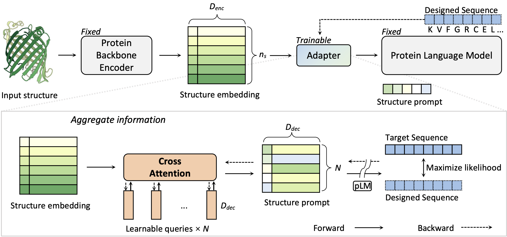
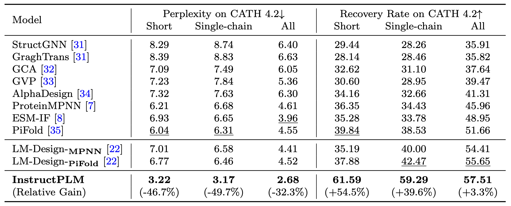

# InstructPLM

Design protein sequences following structure instructions. Read the [InstructPLM](https://www.biorxiv.org/content/10.1101/2024.04.17.589642v1) paper. 

## Setup
We recommend using docker for a quick start.
You can launch an instance of instructPLM with the following commands:
```bash
docker pull jundesiat/instructplm:mpnn-progen2-xlarge
docker run --gpus all -it -v /path/to/input_output:/workspace/ jundesiat/instructplm:mpnn-progen2-xlarge
cd /root/InstructPLM
```

Or you can run InstructPLM from the source code, clone this repo and install dependence: 
```bash
git clone --recurse-submodules https://github.com/Eikor/InstructPLM.git
cd InstructPLM
pip install -r requirements.txt
```

## Usage

<p align="center">

</p>

Code organization:
* [run_eval.py](./run_eval.py) - gives a minimal code of model evaluation (LM-Loss and perplexity).
* [run_generate.py](./run_generate.py) - example of generate protein sequence.
* [recovery_rate.py](./recovery_rate.py) - example of calculating recovery rate of generated sequences.
* [pdbs](pdbs/) - input PDB files.
* [structure_embeddings](structure_embeddings/) - input preprocessed structure embeddings.

>[!IMPORTANT]
> Make sure you have obtained structure embedding before running InstructPLM, you can construct preprocessed structure embeddings by `python structure_embeddings/preprocess.py`.
This script will process protein pdbs stored in `pdbs/` and save the result in `structure_embeddings/`.

### Protein Design
For protein design, run `python run_generate.py --total 10 --save_suffix test`.
This script will read embeddings automatically in `structure_embeddings/` and save the result at the path specified by `--save_prefix`.
For generating fix-length proteins, setting `--fix_length=True`.

>[!TIP]
>Large language models some times suffer from [Hallucinations](https://arxiv.org/pdf/2311.05232), so as pLMs :thinking: . You may need to generate a large set of candidates and a select policy (e.g., TM-Score, DEDAL, etc.) to get better results.

InstructPLM requires a GPU with more than 24GB of VRAM to run, if you encounter an OOM issue, you can try reducing the `--num_return_sequences`.

### Recovery Rate
[recovery_rate.py](./recovery_rate.py) gives a example for calculating recovery rate of generated sequences.

**1. Calculate recovery rate of pre-generated sequences** by indicating the `--sequence_path` and `--sequence_suffix` arguments.
The script read sequences file organized as follows:
```
sequences_path
   ├── seq1_suffix.fasta
   ...
   ├── seqN_suffix.fasta
structure_embeddings
   ├── ref1.pyd
   ...
   └── refN.pyd
```
**2. Generate and calculating use pre-defined parameters.**   Set `--generate` as **True** and passing a empty sequence path.
```python
python recovery_rate.py --sequence_path recovery_res/ --generate
``` 
>[!NOTE]
>Recovery rate only supports protein sequences generated with fix-length. Different seed can cause different results. 


## Results

InstructPLM achieves new SOTA performance on the CATH 4.2 test set:




## Acknowledgments
Please cite our paper:
```
@article {Qiu2024.04.17.589642,
 author = {Jiezhong Qiu and Junde Xu and Jie Hu and Hanqun Cao and Liya Hou and Zijun Gao and Xinyi Zhou and Anni Li and Xiujuan Li and Bin Cui and Fei Yang and Shuang Peng and Ning Sun and Fangyu Wang and Aimin Pan and Jie Tang and Jieping Ye and Junyang Lin and Jin Tang and Xingxu Huang and Pheng Ann Heng and Guangyong Chen},
 title = {InstructPLM: Aligning Protein Language Models to Follow Protein Structure Instructions},
 elocation-id = {2024.04.17.589642},
 year = {2024},
 doi = {10.1101/2024.04.17.589642},
 publisher = {Cold Spring Harbor Laboratory},
 URL = {https://www.biorxiv.org/content/early/2024/04/20/2024.04.17.589642},
 eprint = {https://www.biorxiv.org/content/early/2024/04/20/2024.04.17.589642.full.pdf},
 journal = {bioRxiv}
}

```
